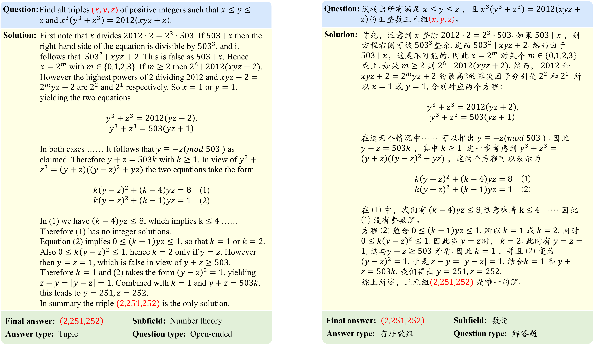
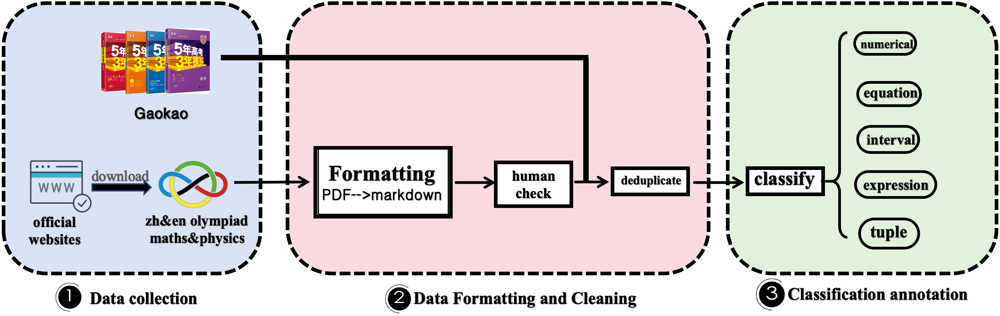
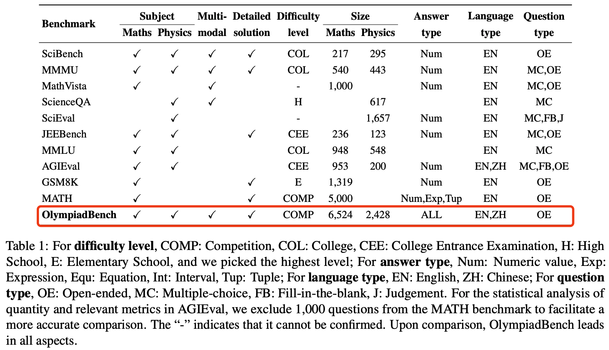
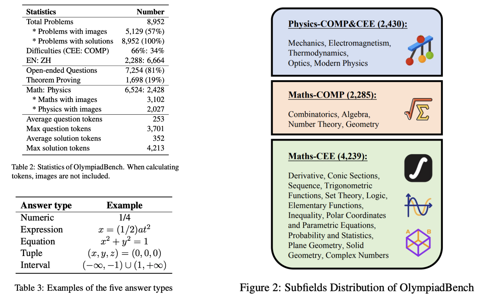
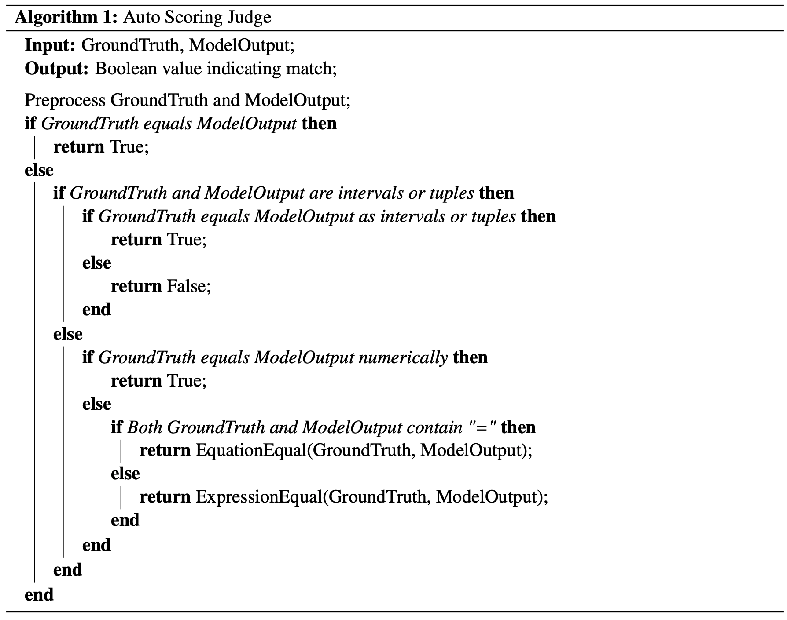
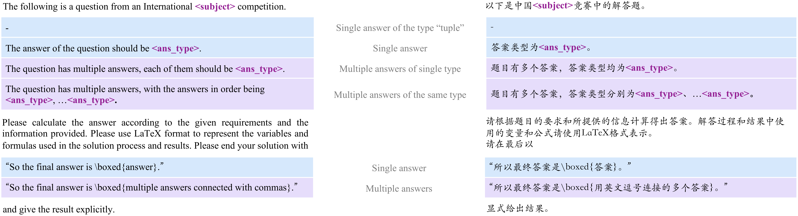
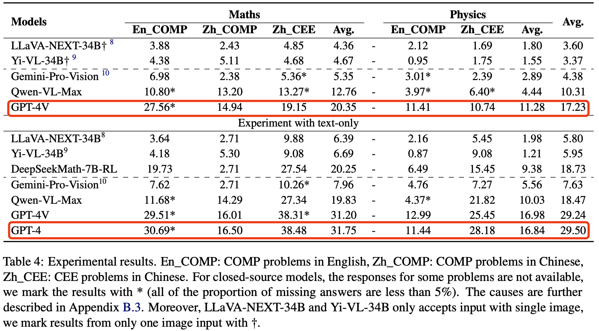

<p align="center">        </p>

<p align="center">
   ⏬ <a href="https://drive.google.com/file/d/1-7bYwoyNQdMr_HEcexRRcMLbXXKjz-5U/view?usp=sharing" target="_blank">Data</a> •   📃 <a href="https://arxiv.org/pdf/2402.14008.pdf" target="_blank">arXiv</a>
</p>


This repo contains the evaluation code for the paper "[OlympiadBench: A Challenging Benchmark for Promoting AGI with
Olympiad-Level Bilingual Multimodal Scientific Problems](https://arxiv.org/pdf/2402.14008.pdf)"

## News!

- **[2024-03-24]** We publish the [experimental code](./inference/) and make updates to the dataset【Previous dataset can be downloaded via this [link](https://drive.google.com/file/d/1Ga_gnrgRWsM59mxLZBa_0GQ2sRfNiTtL/view?usp=sharing)】.

- **[2024-02-16]** The 🔥🔥OlympiadBench🔥🔥 benchmark is released! You can download the dataset from [here](https://drive.google.com/file/d/1-7bYwoyNQdMr_HEcexRRcMLbXXKjz-5U/view?usp=sharing).

## Overview

We introduce OlympiadBench, an Olympiad-level bilingual multimodal scientific benchmark. Notably, the best-performing model, GPT-4V, attains an average score of 17.23\% on OlympiadBench, with a mere 11.28\% in physics, highlighting the benchmark rigor and the intricacy of physical reasoning.

<p align="center"></p>

## Data process

<p align="center"></p>

This collection comprises 8,952 math and physics problems sourced from:
- International Olympiads;
- Chinese Olympiads;
- the Chinese College Entrance Exam (GaoKao)

<!-- Comparisons with related benchmarks are as follows, which show OlympiadBench has a significant advantage.
<p align="center">
      
</p> -->


We use Mathpix OCR to parse official PDFs, then meticulously inspect, clean, revise and dedupe the data. Finally, we annotate the data with crucial information such as answer types and subfields, yielding a dataset that is clean, accurate, and detailed. OlympiadBench includes open-ended questions and proof problems. For the open-ended questions, we standardize the answer format and develop an automated scoring pipeline [here](eval/auto_scoring_judge.py). For the proof problems, we conduct sample assessments.
<!--  -->
<p align="center"></p>
<p align="center"></p>

The downloaded dataset contains two folders, ``data`` and ``images``.
The ``data`` contains the categorized data. For example, OE_MM_physics_en_COMP.json, TP_TO_maths_zh_CEE.json.
      
      * OE: Open-ended questions
      * TP: Theorem proof problems
      * MM: Multimodal
      * TO: Text-only
      * physics: Physics problems
      * maths: Math problems
      * en: English
      * zh: Chinese
      * COMP: Competition problems
      * CEE: Chinese College Entrance Exam problems
``images`` contains the corresponding images in ``data``.

The data format for all datasets is as follows:

      {
            "id": 2231,
            "subfield": "Geometry",
            "context": null,
            "question": "Turbo the snail sits on a point on a circle with circumference 1. Given an infinite sequence of positive real numbers $c_{1}, c_{2}, c_{3}, \\ldots$. Turbo successively crawls distances $c_{1}, c_{2}, c_{3}, \\ldots$ around the circle, each time choosing to crawl either clockwise or counterclockwise.\n\nFor example, if the sequence $c_{1}, c_{2}, c_{3}, \\ldots$ is $0.4,0.6,0.3, \\ldots$, then Turbo may start crawling as follows:\n<img_3362>\n\nDetermine the largest constant $C>0$ with the following property: for every sequence of positive real numbers $c_{1}, c_{2}, c_{3}, \\ldots$ with $c_{i}<C$ for all $i$, Turbo can (after studying the sequence) ensure that there is some point on the circle that it will never visit or crawl across.",
            "solution": [
            "The largest possible $C$ is $C=\\frac{1}{2}$.\n\nFor $0<C \\leqslant \\frac{1}{2}$, ...... that we cannot force Chet out of $[-1+\\varepsilon, 1-\\varepsilon]$. Hence $M \\geqslant 2$ as needed."
            ],
            "final_answer": [
            "$\\frac{1}{2}$"
            ],
            "is_multiple_answer": false,
            "unit": null,
            "answer_type": "Numerical",
            "error": null
      }
* `id`: the unique identifier of the problem.
* `subfield`: the subfield of the problem.
* `context`: the context of the problem.
* `question`: the question of the problem.
* `solution`: the solution of the problem.
* `final_answer`: the final answer of the problem.
* `is_multiple_answer`: whether the problem has multiple answers.
* `unit`: the unit of the answer.
* `answer_type`: the type of the answer.
* `error`: the error of the problem.

## Experiments

We take both open- and closed-source LLMs and LMMs into consideration. Such as GPT-4V, Gemini-Pro-Vision, Yi-VL-34B, DeepSeekMath-7B-RL.
We evaluate the models in a zero-shot setting, and the prompt template for English and Chinese openended questions is shown as follows.

<p align="center"></p>

The key results are as follows:
- GPT-4V only achieves 17.23%. GPT4 gets 29.50% on text-only tasks. 
- A huge gap between closed- and open-source models.
- The challenge lies more on question-with-images, Physics and none-English text.

<p align="center"></p>

## Contact
If interested in our work, please contact us at:

- Chaoqun He: hcq21@mails.tsinghua.edu.cn, hechaoqun1998@gmail.com
- Renjie Luo: renjie.luo@outlook.com
- Yuzhuo Bai: byz22@mails.tsinghua.edu.cn

## Citation

**BibTeX:**
```bibtex
@misc{he2024olympiadbench,
      title={OlympiadBench: A Challenging Benchmark for Promoting AGI with Olympiad-Level Bilingual Multimodal Scientific Problems}, 
      author={Chaoqun He and Renjie Luo and Yuzhuo Bai and Shengding Hu and Zhen Leng Thai and Junhao Shen and Jinyi Hu and Xu Han and Yujie Huang and Yuxiang Zhang and Jie Liu and Lei Qi and Zhiyuan Liu and Maosong Sun},
      year={2024},
      eprint={2402.14008},
      archivePrefix={arXiv},
      primaryClass={cs.CL}
}
```