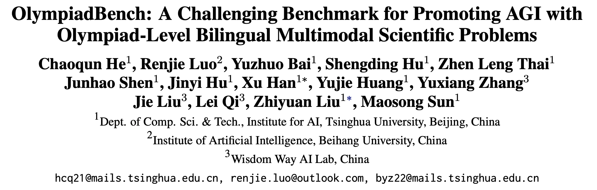
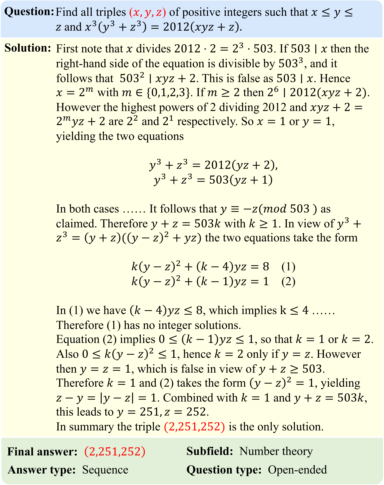
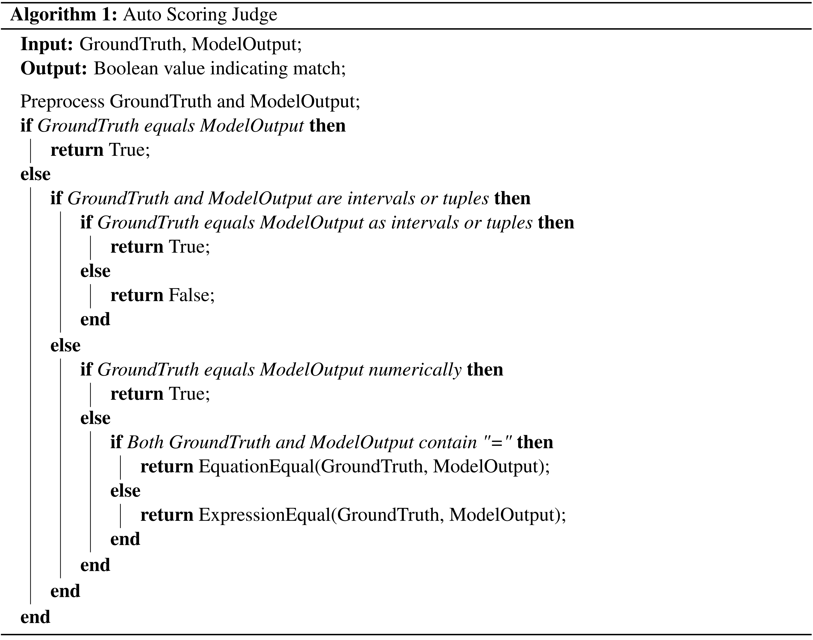

# OlympiadBench


<!-- <p align="center">        </p> -->

<p align="center">
   <!-- 🌐 <a href="https://cevalbenchmark.com/" target="_blank">Website</a> • 🤗 <a href="https://huggingface.co/datasets/ceval/ceval-exam" target="_blank">Hugging Face</a> •  -->
   ⏬ <a href="#data.zip" target="_blank">Data</a> •   📃 <a href="https://arxiv.org/pdf/2402.14008.pdf" target="_blank">arXiv</a>
    <!-- 📖 <a href="resources/tutorial.md" target="_blank">Tutorial (ZH)</a>  <br>   -->
    <!-- <br>
    <a href="https://github.com/SJTU-LIT/ceval/blob/main/README_zh.md">   中文</a> | <a href="https://github.com/SJTU-LIT/ceval/blob/main/README.md">English </a> -->
</p>


This repo contains the evaluation code for the paper "[OlympiadBench: A Challenging Benchmark for Promoting AGI with
Olympiad-Level Bilingual Multimodal Scientific Problems](https://arxiv.org/pdf/2402.14008.pdf)"


## Introduction

We introduce OlympiadBench, an Olympiad-level bilingual multimodal scientific benchmark. This collection comprises 8,952 math and physics problems sourced from International Olympiads, Chinese Olympiads, and the most challenging segments of the Chinese College Entrance Exam (GaoKao). The following picture is an example of the IMO problem from OlympiadBench. 



Each problem is detailed with expert-level annotations for step-by-step reasoning. Evaluating top-tier models on OlympiadBench, we implement a comprehensive assessment methodology to accurately evaluate model responses. 



Notably, the best-performing model, GPT-4V, attains an average score of 17.23\% on OlympiadBench, with a mere 11.28\% in physics, highlighting the benchmark rigor and the intricacy of physical reasoning. 
Our analysis orienting GPT-4V points out prevalent issues with hallucinations, knowledge omissions, and logical fallacies. We hope that our challenging benchmark can serve as a valuable resource for helping future AGI research endeavors. 

## Contact

- Chaoqun He: hcq21@mails.tsinghua.edu.cn, hechaoqun1998@gmail.com
- Renjie Luo: renjie.luo@outlook.com
- Yuzhuo Bai: byz22@mails.tsinghua.edu.cn

## Citation

**BibTeX:**
```bibtex
@misc{he2024olympiadbench,
      title={OlympiadBench: A Challenging Benchmark for Promoting AGI with Olympiad-Level Bilingual Multimodal Scientific Problems}, 
      author={Chaoqun He and Renjie Luo and Yuzhuo Bai and Shengding Hu and Zhen Leng Thai and Junhao Shen and Jinyi Hu and Xu Han and Yujie Huang and Yuxiang Zhang and Jie Liu and Lei Qi and Zhiyuan Liu and Maosong Sun},
      year={2024},
      eprint={2402.14008},
      archivePrefix={arXiv},
      primaryClass={cs.CL}
}
```